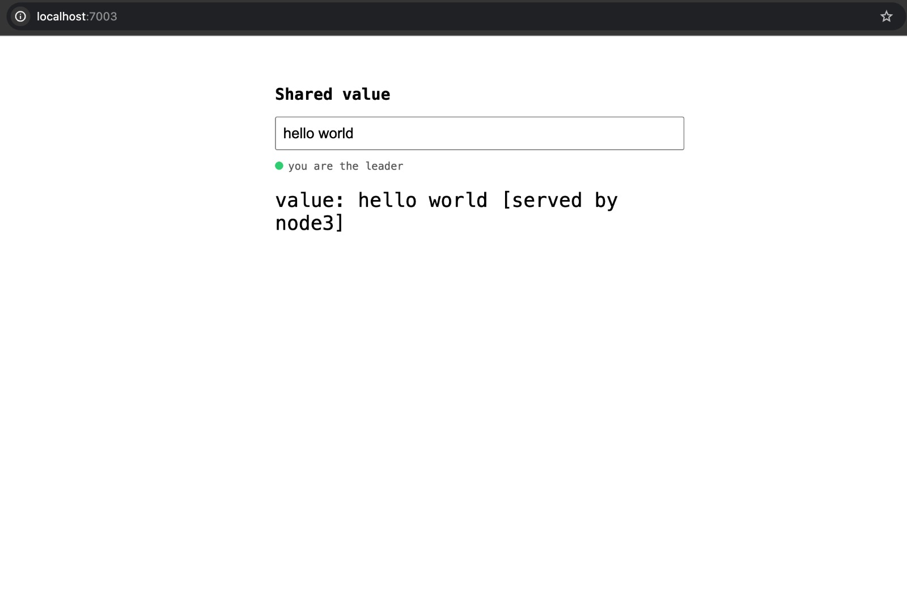
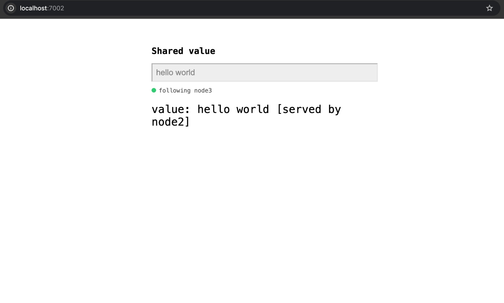
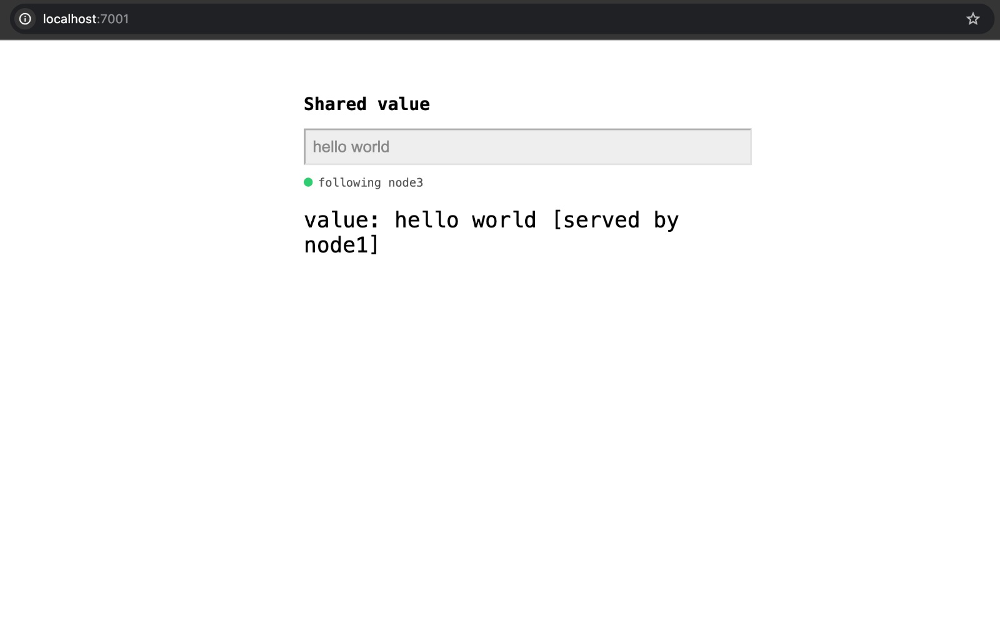
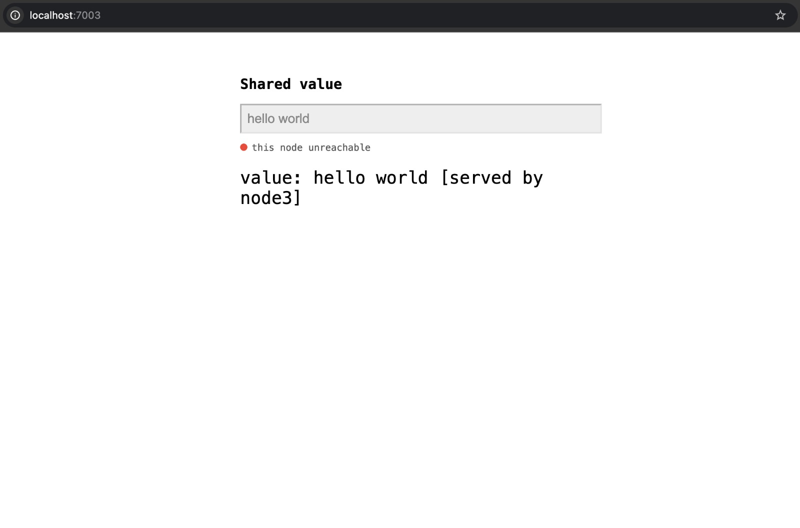
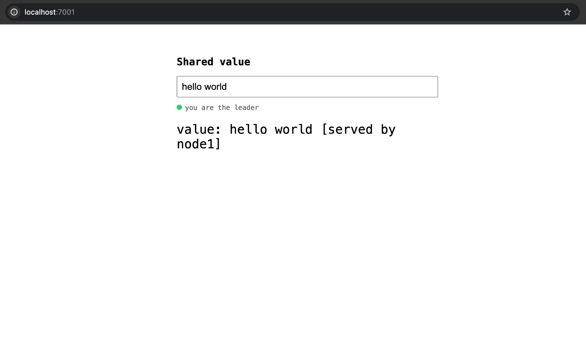

# raft-kv-store

A key-value store built from scratch on top of Raft, a distributed consensus algorithm. Three server processes run independently, elect a leader among themselves, replicate every write across the cluster, and keep working correctly even if a server crashes mid-operation.

This was built as a learning project to understand how real distributed databases stay consistent when machines fail. It follows the original Raft paper by Ongaro and Ousterhout, and the design is close to what MIT's 6.824 distributed systems course assigns.

## What it does

- Stores key-value pairs (SET, GET, DELETE)
- Automatically elects a leader among 3 nodes
- Replicates every write to a majority of nodes before confirming it
- Survives a node crashing at any point, and catches that node up automatically when it restarts
- Correctly handles a simulated network partition: the majority side keeps working, the minority side refuses writes

## What it does not do

This is not a novel algorithm and does not claim to be. Raft already exists and is well documented. This project is an implementation and rigorous testing of it, not research. It also does not include performance optimizations real systems use, like batching or log compaction. Those are listed under "what's missing" below.

## Live demo

Three browser tabs, one per node, showing the same replicated value live.

Node3 as leader, box is editable:

Node2, a follower, read only, showing the same value:

Node3's view again:

Node3 killed mid-demo, that tab goes unreachable:

Node1 automatically takes over as the new leader:

## Running it

You need Go installed. Clone the repo, then in three separate terminals:
go run cmd/server/main.go node1
go run cmd/server/main.go node2
go run cmd/server/main.go node3

Connect a client to whichever one becomes leader (check the terminal logs):

go run cmd/client/main.go localhost:8001

Then type commands like `SET x 5`, `GET x`, `DELETE x`.

## How it's built

Each node runs two listeners: one for client commands (SET/GET/DELETE) and one for internal Raft messages between nodes (RequestVote, AppendEntries), sent as JSON. Every node starts as a follower with a randomized election timeout between 150 and 300ms. If a follower doesn't hear from a leader in that window, it starts an election. A candidate that gets votes from a majority becomes leader and starts sending heartbeats every 50ms to keep the others from starting their own elections.

Writes only go through the leader. A write gets appended to the leader's log, sent to every follower, and only counted as committed once a majority of nodes have it in their log. Only then does it get applied to the actual key-value map and confirmed back to the client.

## Bugs found and fixed along the way

**Leader kept re-electing itself.** Early on, the election timer ran the same way regardless of whether a node was already leader, so a leader would time out on its own heartbeat schedule and start a new election against itself every couple hundred milliseconds. Fixed by having the timer check state first and skip starting an election if the node is already leader.

**Slow recovery after a follower restarted with an empty log.** During chaos testing, a node that crashed and came back empty took far too long to catch up, because the leader was backing off one log index at a time to find where the two logs matched again. With hundreds of entries already written, this could take tens of seconds. Fixed by having followers return exactly where their log actually diverges, so the leader can jump straight to the right point instead of guessing one step at a time. This is the same optimization described in the Raft paper.

**Failover timing measurements that didn't make sense.** First attempts at measuring failover time gave numbers under 20ms, which isn't physically possible given a 150 to 300ms election timeout floor. The problem was measuring from when a human pressed Ctrl+C and then hit Enter, which included reaction time, not the actual failover. Fixed by having the benchmark tool kill the leader itself with a dedicated command and start the timer at that exact instant.

## Numbers

Measured on a single Mac (M-series chip), all three nodes running as separate processes talking over localhost.

- Sustained throughput: about 396 writes/sec with 20 concurrent clients, zero failures
- Failover time: consistently between 250 and 320ms across multiple runs, matching the configured election timeout window

## What's missing

No log compaction or snapshotting, so the log grows forever in memory. No batching of writes, which is probably the biggest reason throughput isn't higher. No persistence to disk, so a full cluster restart loses everything. All of these are known, standard next steps for a real production system, and left out here on purpose to keep the scope focused on getting consensus correct first.

## Testing

Manual chaos testing: random writes sent continuously while nodes are killed and restarted mid-run, then all three nodes checked for identical data afterward. See `cmd/chaos` and `cmd/verify`. Full notes on what broke and what passed are in `DEVLOG.md`.